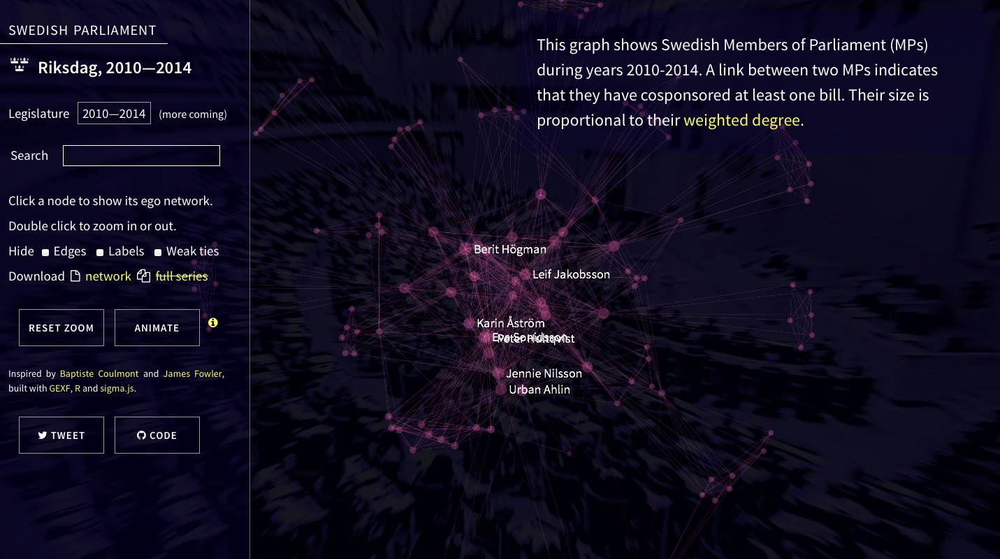

A scraper for Swedish private bills that builds their [cosponsorship network](http://jhfowler.ucsd.edu/cosponsorship.htm). Get the legislation network in R by running `demo.r` a few times, until you get enough data scraped. More data are available through the Riksdag's [open data](http://data.riksdagen.se/) portal.

See the [interactive demo][demo] (in Safari if you want transparency):

[][demo]

[demo]: http://briatte.org/riksdag

The data consist of 1,356 cosponsored bills submitted between September 2011 and June 2014. The nodes are sized proportionally to their [weighted degree](http://toreopsahl.com/2010/04/21/article-node-centrality-in-weighted-networks-generalizing-degree-and-shortest-paths/) and are placed by a Fruchterman-Reingold force-directed algorithm. The ties are undirected and are colorized when they connect two MPs of the same party.
