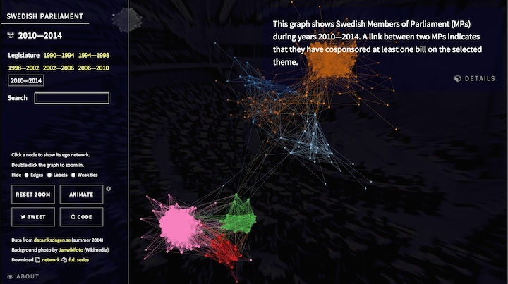

A scraper for Swedish private bills that builds their [cosponsorship network](http://jhfowler.ucsd.edu/cosponsorship.htm). Get the legislation network by running `riksdag.r` in R, and be patient. The data come from the Riksdag's [open data portal](http://data.riksdagen.se/).

See the [interactive demo][demo]:

[][demo]

[demo]: http://briatte.org/riksdag
