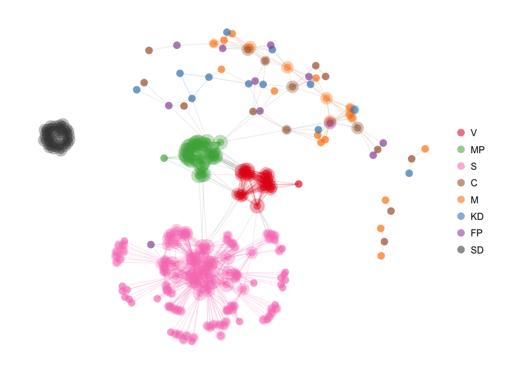

A scraper for Swedish private bills to build their [cosponsorship network](http://jhfowler.ucsd.edu/cosponsorship.htm). See below for a sample graph, or get the full legislation network in R by running `riksdag.r`. __Note:__ the scraper takes hours and might get your IP banned from the Swedish Parliament website.

The data are a random sample of 553 cosponsored bills submitted between September 2011 and April 2014. The nodes are sized proportionally to their [weighted degree](http://toreopsahl.com/2010/04/21/article-node-centrality-in-weighted-networks-generalizing-degree-and-shortest-paths/) and are placed by a Fruchterman-Reingold force-directed algorithm. The ties are undirected and are colorized when they connect two MPs of the same party.

The full graph is best viewed with the Kamada-Kawai algorithm to detach the nodes in each party group:

